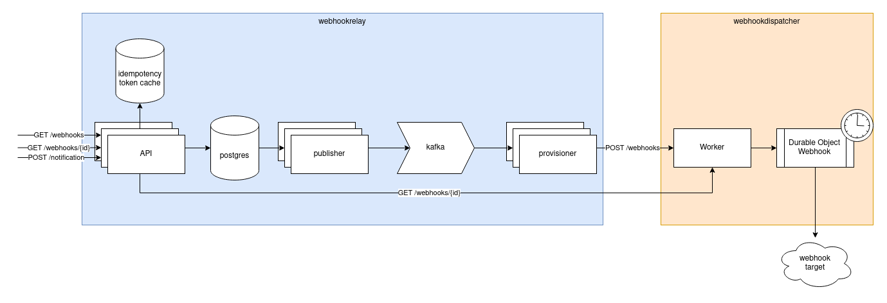

# WebhookDispatcher

WebhookDispatcher is a Cloudflare Workers service that accepts webhook requests, then manages a Durable Object
which reliably dispatches the payload to the target.

The Durable Object manages retries with exponential backoff and tracks the dispatch attempts.



Receives webhook requests from [WebhookRelay](https://github.com/broswen/webhookrelay) provisioner.

### Internal Dispatcher State

```json
{
	"id": "9a2bfac2-0794-431f-ac4a-7fb83e0dc4aa",
	"target": "https:/honeypot.broswen.com",
	"payload": "eyJtZXNzYWdlIjoiaGVsbG8gd29ybGQiLCJ0ZXN0Ijp0cnVlfQ==",
	"attempts": [
		{
			"timestamp": "2024-02-14T20:28:08.480Z",
			"status": 500,
			"message": "Error: 500: Internal Server Error"
		},
		{
			"timestamp": "2024-02-14T20:28:08.495Z",
			"status": 200,
			"message": "success"
		}
	],
	"provisionedAt": "2024-02-14T20:28:08.433Z",
	"status": "SUCCEEDED"
}
```

### TODO
- [x] include a signed token with expiration and webhook id in the payload to allow authentication
  - [ ] handle key rotations nicely, expose the previous public key
  - [ ] create a utility to generate/encode new secrets
- [ ] send expiration timestamp on webhooks to prevent replay attacks
- [ ] set up vitest testing
